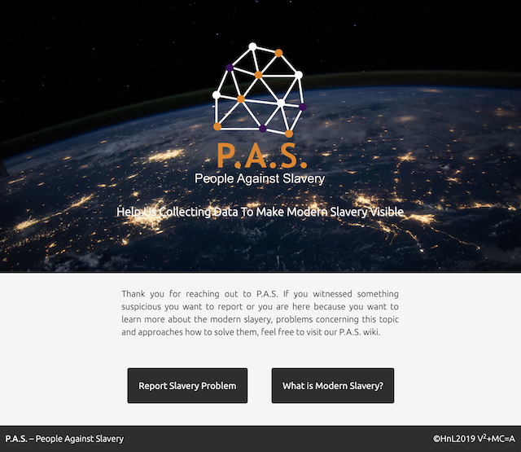
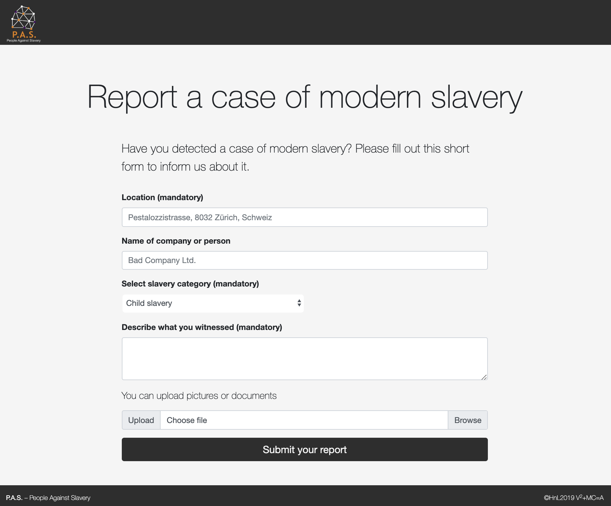
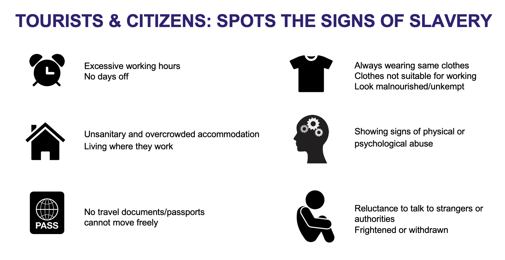

# [Hack n Lead 2019](https://womenplusplus.ch/hacknlead)

This repository was created during the Hack'n'Lead 2019 organized by women++.
For more information about Switzerland's first womenfriendly Hackathon please visit: https://www.womenplusplus.ch/hacknlead

===

# P.A.S. – People Against Slavery

## Team V2+MC=A

Our team consisted of four people:
* **V**alentina Coco – Project Management, Business, Presentation and Chocolate Supplier
* **V**alentina Tamburello – Data Sciences and Coding
* **M**arina Kraus – Coding, Project Management and Documentation
* **C**hanel Greco – Coding, Project Management and Teaching Marina

## Thomson Reuters Challenge

The [Thomson Reuters Challenge](https://share.nuclino.com/p/HacknLead-2019-Challenges-6o0DigwQEVIL2ZSXrBcY_x) which we choose covered the topic:

**"Combating Modern Slavery in the Supply Chains through Technology"**

## Preparation for Hack'n'Lead

As challenges were published, Valentina Coco invited the team to attend a virtual design sprint. 
During one hour of brainstorming we worked out:
- things which will work for us concerning the topic
- problems we see in context of modern slavery
- ideas how we could use technology to fight modern slavery

We decided as a team to creat a webapp which allows people around the globe to report slavery issues the witness in an easy way. The data should be visible in a public heat map to create awareness of problematic hotspots when it comes to modern slavery. 

## P.A.S. – People Against Slavery

The webapp is called **P.A.S. – People Against Slavery**. It is a webapp and not a mobile app for iOs and Andriod so it's not limited to any OS or device and everyone can use it in the browser.

### Home
The webapp covers the opportunity to report slavery issues and a section where everybody can read more about the problems in context.

### Reporting issues

The reportin form is fitted with a geolocator to fill out the position information automatically.

### Modern Slavery Wiki
The Modern Slavery wiki is the educational part of the app. A draft how this wiki could look like and which categories of information and links to external sources it could contain are just documented in the presentation slides but not in the app until now.

This is an example on topics the wiki could contain:

## Further information
Further information concerning the P.A.S. project you can in the presentation slides inside the docs folder. There is also included a detailed version of the business model.

## License

 [GNU GENERAL PUBLIC LICENSE, Version 3, 29 June 2007](https://github.com/chanelgreco/hack-n-lead-2019-template-repository/blob/master/LICENSE)
