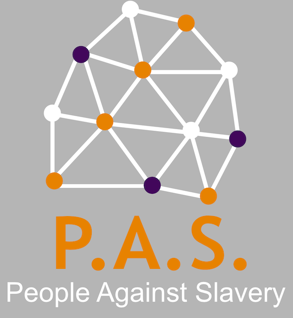

# [Hack n Lead 2019](https://womenplusplus.ch/hacknlead)

This repository was created during the Hack'n'Lead 2019 organized by women++.
For more information about Switzerland's first womenfriendly Hackathon please visit: https://www.womenplusplus.ch/hacknlead

===
# P.A.S. – People Against Slavery

## Team V2+MC=A

Our team consisted of four people:
* **V**alentina Coco – Project Management, Business, Presentation and Chocolate Supplier
* **V**alentina Tamburello – Data Sciences and Coding
* **M**arina Kraus – Coding, Project Management and Documentation
* **C**hanel Greco – Coding, Project Management and Teaching Marina

## Thomson Reuters Challenge

The Thomson Reuters Challenge which we choose covered the topic:

**"Combating Modern Slavery in the Supply Chains through Technology"**

## Preparation for Hack'n'Lead

As challenges were published, Valentina Coco invited the team to attend a virtual design sprint. 
During one hour of brainstorming we worked out:
- things which will work for us concerning the topic
- problems we see in context of modern slavery
- ideas how we could use technology to fight modern slavery

We decided as a team to creat a webapp which allows people around the globe to report slavery issues the witness in an easy way. The data should be visible in a public heat map to create awareness of problematic hotspots when it comes to modern slavery. 

## P.A.S. – People Against Slavery

The webapp is called **P.A.S. – People Against Slavery**. It is a webapp and not a mobile app for iOs and Andriod so it's not limited to any OS or device and everyone can use it in the browser.

- description parts of the app 

- screenshot index page

- description form

- screenshot form

- description education part

- screen from presentation

## License

GNU...

